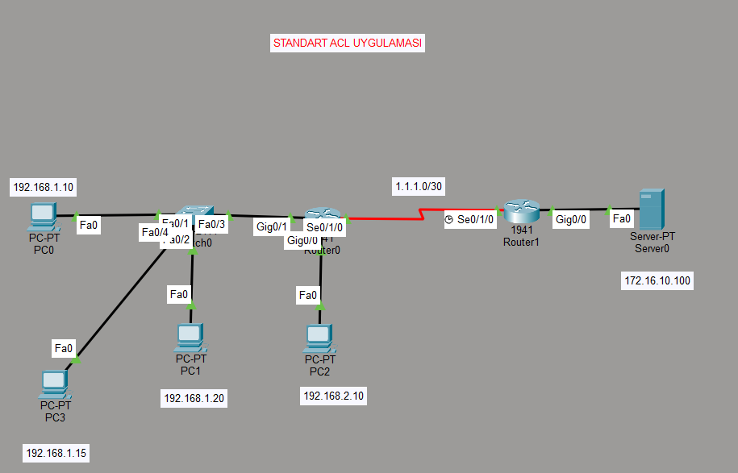

🔐 Cisco Packet Tracer Lab – Static Routing & Standard ACL
📌 Proje Genel Bakış

Bu lab çalışmasında iki routerlı bir topoloji üzerinde:

/30 subnet kullanılarak WAN bağlantısı kurulmuştur

Statik routing yapılandırılmıştır

Standard Access Control List (ACL) uygulanmıştır

🌐 Ağ Topolojisi
WAN Bağlantısı
1.1.1.0/30

LAN Ağları

192.168.1.0/24

192.168.2.0/24

172.16.10.0/24 (Server Ağı)

Server IP
172.16.10.100 /24

🔎 Standard ACL Deneyimi

Bu lab çalışmasında Standard ACL kullanılarak belirli kaynak IP adresleri filtrelenmiştir.

Amaç

192.168.1.0/24 ağını engellemek

192.168.2.0/24 ağını izinli bırakmak

192.168.1.10 hostuna özel izin vermek

ACL Yapılandırması
access-list 10 permit 192.168.1.10
access-list 10 deny 192.168.1.0 0.0.0.255
access-list 10 permit 192.168.2.0 0.0.0.255

🧠 Bu Çalışmada Öğrenilenler

Standard ACL’ler yalnızca kaynak IP adresine göre filtreleme yapar.

ACL’ler yukarıdan aşağıya doğru çalışır.

İlk eşleşen kural uygulanır.

Her ACL’nin sonunda varsayılan bir implicit deny bulunur.

Wildcard mask (0.0.0.255) kullanım mantığı öğrenilmiştir.

## 🖼 Topoloji Görseli

